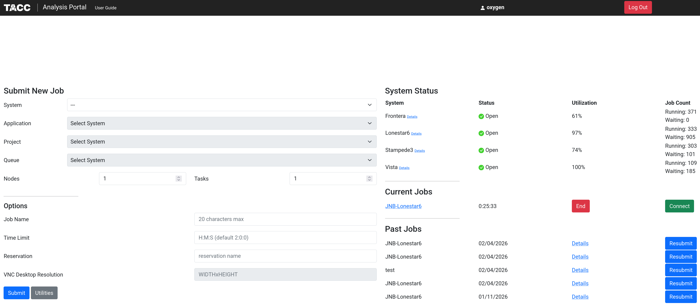
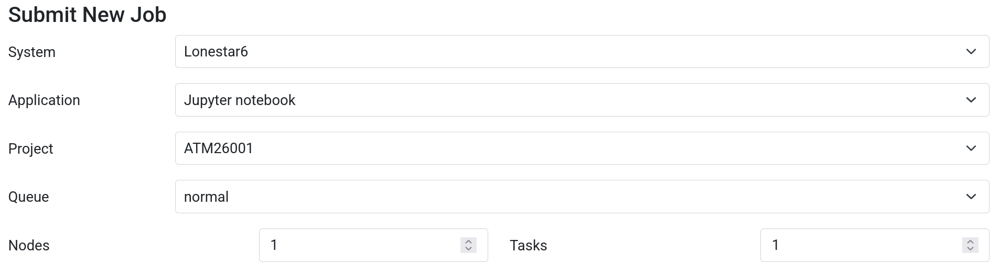
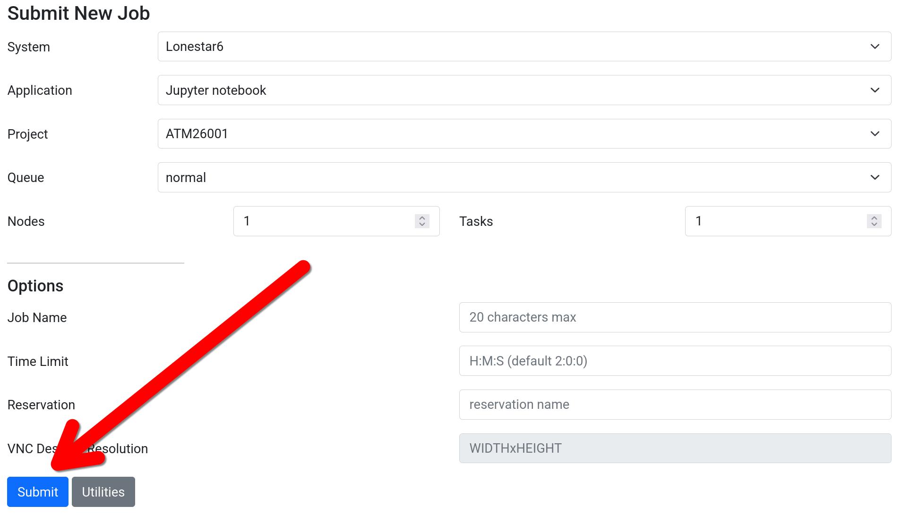
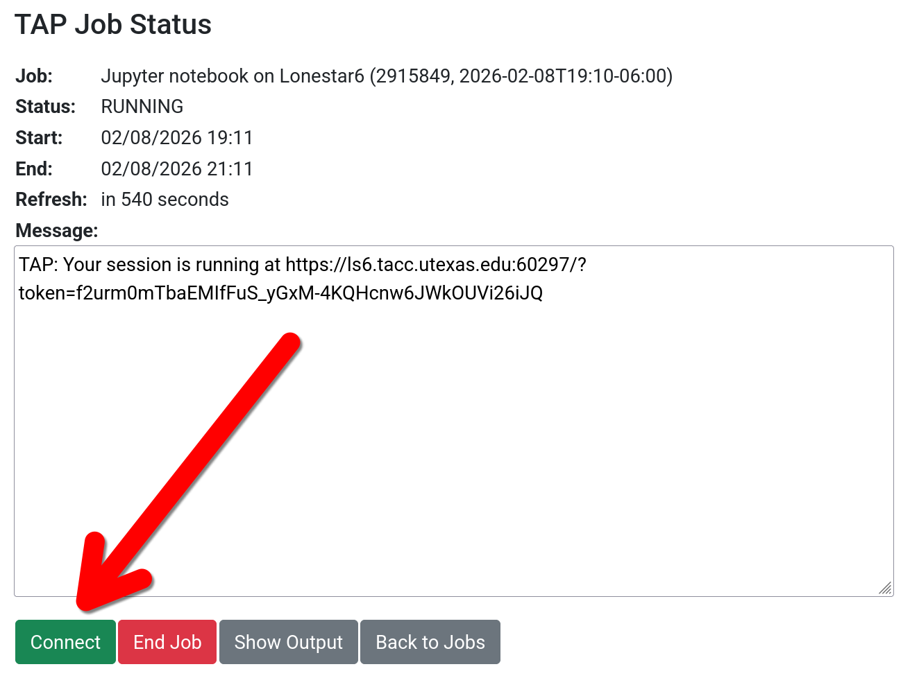
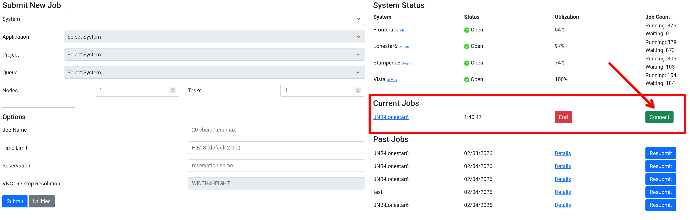
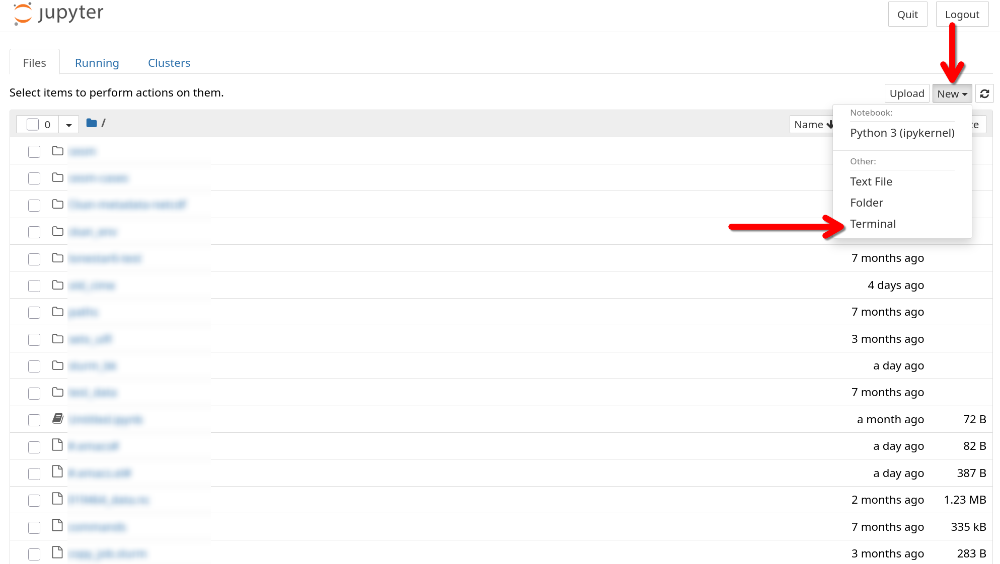
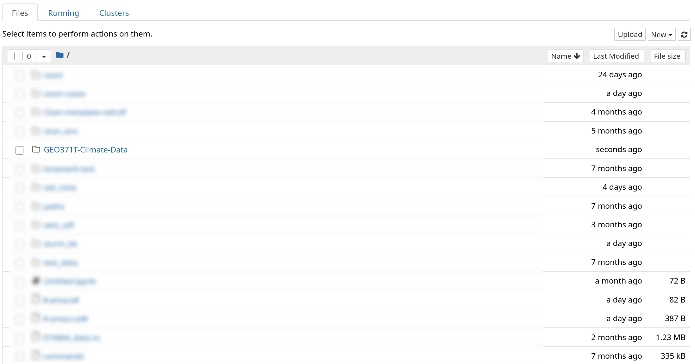
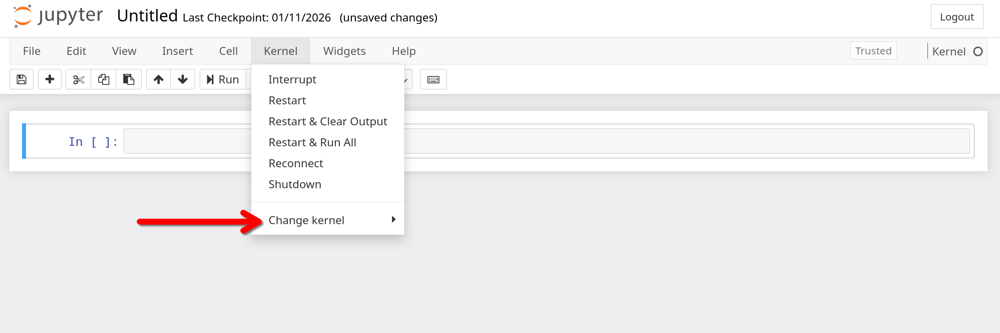

# GEO 371T - Climate Data

## UPDATE: *Added new steps for accessing Python Kernel*

[Click here to skip to the new section](#3-accessing-geo-371t-python-kernel)

## 1. Connecting to the TACC Analysis Portal

The TACC Analysis Portal (TAP) provides a web-interface for starting Jupyter Notebook servers on high-performance compute nodes. [You can view more detailed documentation here](https://docs.tacc.utexas.edu/tutorials/TAP/) or just follow the steps below. Start by logging into web-app:

[https://tap.tacc.utexas.edu/](https://tap.tacc.utexas.edu/)

Once logged in, you should see a menu that looks like this:



For GEO 371T, we have an allocation on Lonestar6 ([you can read more about LS6 here](https://tacc.utexas.edu/systems/lonestar6/)) and a reservation for quickly getting through the queue during lecture. The reservation name may occasionally change, but the class allocation name will remain the same. Select the entries from drop down menus shown below:

```
Submit New Job
--------------

System: Lonestar6
Application: Jupyter Notebook
Queue: normal
    (can also use "development" if reservation isn't available)
Node: 1
Tasks 1 
    (take note, we may increase this later for handling bigger datasets)


Optional Arguments
------------------

Time Limit: You can change the 2-hour default (max. 2 hrs for "development" queue)
Reservation: Ask Dr. Persad, can help get through queue wait times
```



### Make sure to add the **"Reservation Code"** if doing this during lecture.

Then hit the "Submit" button to put your request for a Jupyter Notebook server in the queue on LS6.



The web-app should then automatically redirect you to a "TAP Job Status" page that actively monitors your server. It may wait in the queue for a bit, but eventually it should appear as "RUNNING" and prompt you to connect.



Connecting to the server will redirect you to its Jupyter Notebook interface, which is actively being hosted on a compute node apart of LS6. Keep in mind that the server will only remain online for 2 hours by default (this can be changed on the job menu before submitting). 

### **After 2 hours, the server will shutdown and all unsaved work will be lost.**

**Make sure to frequently save your work and pay attention to the time!**

If you get disconnected from your server, you can reconnect by revisiting the [TAP homepage](https://tap.tacc.utexas.edu/):




## 2. Downloading and Updating the Class Repostiory

Once connected to LS6, you will need to clone this repository to gain access to the class materials. You can do this from a Jupyter Notebook server or [via SSH](https://docs.tacc.utexas.edu/hpc/lonestar6/#access) if you prefer that. For the Notebook approach, start a terminal by clicking on the "New" drop-down menu in the top right corner and then "Terminal":



First navigate to your home directory:

```
cd $HOME
```

Then use `git` to clone this repository:

```
git clone https://github.com/PersadAeroClimateLab/GEO371T-Climate-Data.git
```

Return to your Jupyter interface, the `GEO371T-Climate-Data/` directory should be visible:



This class is still being actively developed, so we will periodically push updates to the main branch of this GitHub repository. However, the copy of this repository in your home directory does not automatically update and will require manual intervention In a terminal, run the following commands to update:

```
cd $HOME/GEO371T-Climate-Data
git pull
```

## 3. Accessing GEO 371T Python Kernel

We have built a custom container for a Python kernel that has the necessary packages for running class notebooks. To access it, you need to configure TAP to see the new kernel. In a terminal, run the following command:
```
mkdir -p ~/.local/share/jupyter/kernels/geo371t && cp /scratch/07644/oxygen/GEO371T/kernel.json ~/.local/share/jupyter/kernels/geo371t/
```

Then, in a Jupyter notebook, change to the new kernel. It should appear as "GEO 371T".




## 4. Handling Update Merge Conflicts

Note that if you make changes to files in your local repository that get updated in the GitHub repository, an error will appear indicating a merge is necessary. We try to avoid modifying assignment notebooks after they are posted, but other files may be updated as development continues. In this situation, use git to handle the merge.

First, identify problematic files that need merging from the error message. Example error message after `git pull`:
```
remote: Enumerating objects: 7, done.
remote: Counting objects: 100% (7/7), done.
remote: Compressing objects: 100% (2/2), done.
remote: Total 4 (delta 2), reused 4 (delta 2), pack-reused 0 (from 0)
Unpacking objects: 100% (4/4), 405 bytes | 11.00 KiB/s, done.
From https://github.com/PersadAeroClimateLab/GEO371T-Climate-Data
   40758ab..3baeb71  main       -> origin/main
Updating 40758ab..3baeb71
error: Your local changes to the following files would be overwritten by merge:
        assignment_notebooks/A1-IntroToClimateData.ipynb
Please commit your changes or stash them before you merge.
Aborting
```

In this case, local changes made to `assignment_notebooks/A1-IntroToClimateData.ipynb` are conflicting and require a merge. We can further identify them with `git status`:
```
c306-006.ls6(1010)$ git status

On branch main
Your branch is behind 'origin/main' by 1 commit, and can be fast-forwarded.
  (use "git pull" to update your local branch)

Changes not staged for commit:
  (use "git add <file>..." to update what will be committed)
  (use "git restore <file>..." to discard changes in working directory)
        modified:   assignment_notebooks/A1-IntroToClimateData.ipynb
```

First, make a backup of that file so that you can keep your local version:

```
cp assignment_notebooks/A1-IntroToClimateData.ipynb assignment_notebooks/my_copy_A1-IntroToClimateData.ipynb
```

**MAKE SURE YOU HAVE COPIED THE ORIGINAL FILE. THIS NEXT STEP WILL OVERWRITE YOUR COPY.**

Then, to overwrite it with the GitHub copy, use `git restore` (*only after making a copy of your original file*):

```
git restore assignment_notebooks/A1-IntroToClimateData.ipynb
git pull
```

## Running Locally

You can run your own server locally to access the same packages within TAP. The paths referenced in notebooks are TACC-specific, so unless you are running the server on a system with access to TACC filesystems, you will likely need to change them. First, clone the repository:

```
git clone https://github.com/PersadAeroClimateLab/GEO371T-Climate-Data.git
cd GEO371T-Climate-Data
```

Then build the container:

```
docker build -t geo371t .
```

Start the container and mount the repository so that edited files are saved to disk (note that the token is empty, do not do this for publicly-accessible containers):

```
docker run -u $(id -u) -it geo371t jupyter lab \
  --port=8888 \
  --ServerApp.token='' \
  --ServerApp.password='' \
  --ServerApp.ip=0.0.0.0
```

## Contribution Guidelines

If you are familiar with GitHub and would like to contribute an update, feel free to [fork this repository](https://docs.github.com/en/pull-requests/collaborating-with-pull-requests/working-with-forks/fork-a-repo) and [submit a pull request](https://docs.github.com/en/pull-requests/collaborating-with-pull-requests/proposing-changes-to-your-work-with-pull-requests/creating-a-pull-request-from-a-fork).

