# Data Overview — Climate Analysis Project

> **Project title:** GEO 371T Climate Data Computational Analysis
> 
> **Contact:** cameron.cummins@utexas.edu, geeta.persad@jsg.utexas.edu
> 
> **Repository:** https://github.com/PersadAeroClimateLab/GEO371T-Climate-Data

---



## 1. Preprocessing Summary and Directory Structure

All datasets are pre-processed into units of `mm/day` and coordinates `(time, lat, lon)` with `lon=[0-360]`. The three accumulation metrics are derived as well.

| Path | Description |
|------|-------------|
| `data/` | Head directory for all pre-processed datasets. |
| `data/zarr_stores/` | Pre-processed Zarr stores for rolling 1-day, 3-day, and 5-day precipitation metrics. |
| `data/netcdf_files/` | Yearly-chunked NetCDF time slices from `data/zarr_stores/` |
| `data/interp_zarr_stores/` | Derived from `zarr_stores` interpolated to same grid and calendars for valid comparisons. |
| `data/interp_netcdf` | Mirror of `zarr_stores` but in NetCDF format. |
| `data/statistics/`| Smaller NetCDF products (i.e. yearly resamples) derived from Zarr stores.  |

---

## 2. Dataset Inventory

| ID | Dataset | Type | Experiments | Ensemble Strategy | Temporal Coverage | Access |
|----|---------|------|-------------|-------------------|-------------------|--------|
| D1 | CMIP6 multi-model | GCM projections | historical, ssp245, ssp370 | 1 member per model, 23 models | historical: 1980-2014; ssp: 2015-2100 | Public |
| D2 | GFDL-SPEAR-MED | Large ensemble | historical, ssp585 | 30 members | historical: 1980-2014; ssp585: 2015-2100 | Public |
| D3 | MSWEP | Observational reanalysis | n/a | n/a | 1980-2024 | Request Access |
| D4 | ERA5 | Observational reanalysis | n/a | n/a | 1980-2024 | Public |
| D5 | NOAA CPC | Observational reanalysis | n/a | n/a | 1980-2024 | Public |

---

## 3. CMIP6 Multi-Model Archive (D1)

### 3.1 Source and Access

- **Archive:** AWS S3, https://registry.opendata.aws/cmip6/
- **Activity:** CMIP / ScenarioMIP
- **Download method:** S3 Python API
- **Date of download/access:** 2026-04-01
- **CMIP6 Citation / DOI:** Coupled Model Intercomparison Project 6 was accessed on 2026-04-01 from https://registry.opendata.aws/cmip6. 

### 3.2 Experiments

| Experiment | Forcing | Available Period | Actual Period Used |
|------------|---------|----------------|--------------------|
| historical | Observed forcings | 1850-2014 | 1980-2014 |
| ssp245 | SSP2-4.5 | 2015-2100 | 2015-2100 |
| ssp370 | SSP3-7.0 | 2015-2100 | 2015-2100 |
| ssp585 | SSP5-8.5 | 2015-2100 | 2015-2100 |

### 3.3 Model List

| # | Model (source_id) | Scenario | Member ID | Grid Spec. | Store Path |
|---|-------------------|-------------|---------------|---------------------------|-------|
| 0 | ACCESS-CM2 | historical | r1i1p1f1 | gn | s3://cmip6-pds/CMIP6/CMIP/CSIRO-ARCCSS/ACCESS-CM2/historical/r1i1p1f1/day/pr/gn/v20191108/ |
| 1 | ACCESS-CM2 | ssp585 | r1i1p1f1 | gn | s3://cmip6-pds/CMIP6/ScenarioMIP/CSIRO-ARCCSS/ACCESS-CM2/ssp585/r1i1p1f1/day/pr/gn/v20210317/ |
| 2 | ACCESS-CM2 | ssp370 | r1i1p1f1 | gn | s3://cmip6-pds/CMIP6/ScenarioMIP/CSIRO-ARCCSS/ACCESS-CM2/ssp370/r1i1p1f1/day/pr/gn/v20191108/ |
| 3 | ACCESS-CM2 | ssp245 | r1i1p1f1 | gn | s3://cmip6-pds/CMIP6/ScenarioMIP/CSIRO-ARCCSS/ACCESS-CM2/ssp245/r1i1p1f1/day/pr/gn/v20191108/ |
| 4 | BCC-CSM2-MR | ssp370 | r1i1p1f1 | gn | s3://cmip6-pds/CMIP6/ScenarioMIP/BCC/BCC-CSM2-MR/ssp370/r1i1p1f1/day/pr/gn/v20190318/ |
| 5 | BCC-CSM2-MR | historical | r1i1p1f1 | gn | s3://cmip6-pds/CMIP6/CMIP/BCC/BCC-CSM2-MR/historical/r1i1p1f1/day/pr/gn/v20181126/ |
| 6 | BCC-CSM2-MR | ssp245 | r1i1p1f1 | gn | s3://cmip6-pds/CMIP6/ScenarioMIP/BCC/BCC-CSM2-MR/ssp245/r1i1p1f1/day/pr/gn/v20190318/ |
| 7 | BCC-CSM2-MR | ssp585 | r1i1p1f1 | gn | s3://cmip6-pds/CMIP6/ScenarioMIP/BCC/BCC-CSM2-MR/ssp585/r1i1p1f1/day/pr/gn/v20190318/ |
| 8 | CESM2-WACCM | ssp370 | r1i1p1f1 | gn | s3://cmip6-pds/CMIP6/ScenarioMIP/NCAR/CESM2-WACCM/ssp370/r1i1p1f1/day/pr/gn/v20190815/ |
| 9 | CESM2-WACCM | historical | r1i1p1f1 | gn | s3://cmip6-pds/CMIP6/CMIP/NCAR/CESM2-WACCM/historical/r1i1p1f1/day/pr/gn/v20190415/ |
| 10 | CESM2-WACCM | ssp585 | r1i1p1f1 | gn | s3://cmip6-pds/CMIP6/ScenarioMIP/NCAR/CESM2-WACCM/ssp585/r1i1p1f1/day/pr/gn/v20200702/ |
| 11 | CESM2-WACCM | ssp245 | r1i1p1f1 | gn | s3://cmip6-pds/CMIP6/ScenarioMIP/NCAR/CESM2-WACCM/ssp245/r1i1p1f1/day/pr/gn/v20190815/ |
| 12 | CMCC-CM2-SR5 | ssp370 | r1i1p1f1 | gn | s3://cmip6-pds/CMIP6/ScenarioMIP/CMCC/CMCC-CM2-SR5/ssp370/r1i1p1f1/day/pr/gn/v20200622/ |
| 13 | CMCC-CM2-SR5 | historical | r1i1p1f1 | gn | s3://cmip6-pds/CMIP6/CMIP/CMCC/CMCC-CM2-SR5/historical/r1i1p1f1/day/pr/gn/v20200616/ |
| 14 | CMCC-CM2-SR5 | ssp585 | r1i1p1f1 | gn | s3://cmip6-pds/CMIP6/ScenarioMIP/CMCC/CMCC-CM2-SR5/ssp585/r1i1p1f1/day/pr/gn/v20200622/ |
| 15 | CMCC-CM2-SR5 | ssp245 | r1i1p1f1 | gn | s3://cmip6-pds/CMIP6/ScenarioMIP/CMCC/CMCC-CM2-SR5/ssp245/r1i1p1f1/day/pr/gn/v20200617/ |
| 16 | CMCC-ESM2 | ssp370 | r1i1p1f1 | gn | s3://cmip6-pds/CMIP6/ScenarioMIP/CMCC/CMCC-ESM2/ssp370/r1i1p1f1/day/pr/gn/v20210202/ |
| 17 | CMCC-ESM2 | ssp585 | r1i1p1f1 | gn | s3://cmip6-pds/CMIP6/ScenarioMIP/CMCC/CMCC-ESM2/ssp585/r1i1p1f1/day/pr/gn/v20210126/ |
| 18 | CMCC-ESM2 | ssp245 | r1i1p1f1 | gn | s3://cmip6-pds/CMIP6/ScenarioMIP/CMCC/CMCC-ESM2/ssp245/r1i1p1f1/day/pr/gn/v20210129/ |
| 19 | CMCC-ESM2 | historical | r1i1p1f1 | gn | s3://cmip6-pds/CMIP6/CMIP/CMCC/CMCC-ESM2/historical/r1i1p1f1/day/pr/gn/v20210114/ |
| 20 | CanESM5 | ssp370 | r1i1p1f1 | gn | s3://cmip6-pds/CMIP6/ScenarioMIP/CCCma/CanESM5/ssp370/r1i1p1f1/day/pr/gn/v20190429/ |
| 21 | CanESM5 | ssp245 | r1i1p1f1 | gn | s3://cmip6-pds/CMIP6/ScenarioMIP/CCCma/CanESM5/ssp245/r1i1p1f1/day/pr/gn/v20190429/ |
| 22 | CanESM5 | ssp585 | r1i1p1f1 | gn | s3://cmip6-pds/CMIP6/ScenarioMIP/CCCma/CanESM5/ssp585/r1i1p1f1/day/pr/gn/v20190429/ |
| 23 | CanESM5 | historical | r1i1p1f1 | gn | s3://cmip6-pds/CMIP6/CMIP/CCCma/CanESM5/historical/r1i1p1f1/day/pr/gn/v20190429/ |
| 24 | EC-Earth3 | ssp370 | r1i1p1f1 | gr | s3://cmip6-pds/CMIP6/ScenarioMIP/EC-Earth-Consortium/EC-Earth3/ssp370/r1i1p1f1/day/pr/gr/v20200310/ |
| 25 | EC-Earth3 | historical | r1i1p1f1 | gr | s3://cmip6-pds/CMIP6/CMIP/EC-Earth-Consortium/EC-Earth3/historical/r1i1p1f1/day/pr/gr/v20200310/ |
| 26 | EC-Earth3 | ssp245 | r1i1p1f1 | gr | s3://cmip6-pds/CMIP6/ScenarioMIP/EC-Earth-Consortium/EC-Earth3/ssp245/r1i1p1f1/day/pr/gr/v20200310/ |
| 27 | EC-Earth3 | ssp585 | r1i1p1f1 | gr | s3://cmip6-pds/CMIP6/ScenarioMIP/EC-Earth-Consortium/EC-Earth3/ssp585/r1i1p1f1/day/pr/gr/v20200310/ |
| 28 | EC-Earth3-Veg | historical | r1i1p1f1 | gr | s3://cmip6-pds/CMIP6/CMIP/EC-Earth-Consortium/EC-Earth3-Veg/historical/r1i1p1f1/day/pr/gr/v20200225/ |
| 29 | EC-Earth3-Veg | ssp370 | r1i1p1f1 | gr | s3://cmip6-pds/CMIP6/ScenarioMIP/EC-Earth-Consortium/EC-Earth3-Veg/ssp370/r1i1p1f1/day/pr/gr/v20200225/ |
| 30 | EC-Earth3-Veg | ssp245 | r1i1p1f1 | gr | s3://cmip6-pds/CMIP6/ScenarioMIP/EC-Earth-Consortium/EC-Earth3-Veg/ssp245/r1i1p1f1/day/pr/gr/v20200225/ |
| 31 | EC-Earth3-Veg | ssp585 | r1i1p1f1 | gr | s3://cmip6-pds/CMIP6/ScenarioMIP/EC-Earth-Consortium/EC-Earth3-Veg/ssp585/r1i1p1f1/day/pr/gr/v20200225/ |
| 32 | EC-Earth3-Veg-LR | ssp370 | r1i1p1f1 | gr | s3://cmip6-pds/CMIP6/ScenarioMIP/EC-Earth-Consortium/EC-Earth3-Veg-LR/ssp370/r1i1p1f1/day/pr/gr/v20201123/ |
| 33 | EC-Earth3-Veg-LR | ssp585 | r1i1p1f1 | gr | s3://cmip6-pds/CMIP6/ScenarioMIP/EC-Earth-Consortium/EC-Earth3-Veg-LR/ssp585/r1i1p1f1/day/pr/gr/v20201201/ |
| 34 | EC-Earth3-Veg-LR | historical | r1i1p1f1 | gr | s3://cmip6-pds/CMIP6/CMIP/EC-Earth-Consortium/EC-Earth3-Veg-LR/historical/r1i1p1f1/day/pr/gr/v20200217/ |
| 35 | EC-Earth3-Veg-LR | ssp245 | r1i1p1f1 | gr | s3://cmip6-pds/CMIP6/ScenarioMIP/EC-Earth-Consortium/EC-Earth3-Veg-LR/ssp245/r1i1p1f1/day/pr/gr/v20201123/ |
| 36 | FGOALS-g3 | ssp585 | r1i1p1f1 | gn | s3://cmip6-pds/CMIP6/ScenarioMIP/CAS/FGOALS-g3/ssp585/r1i1p1f1/day/pr/gn/v20190818/ |
| 37 | FGOALS-g3 | ssp370 | r1i1p1f1 | gn | s3://cmip6-pds/CMIP6/ScenarioMIP/CAS/FGOALS-g3/ssp370/r1i1p1f1/day/pr/gn/v20190820/ |
| 38 | FGOALS-g3 | historical | r1i1p1f1 | gn | s3://cmip6-pds/CMIP6/CMIP/CAS/FGOALS-g3/historical/r1i1p1f1/day/pr/gn/v20190826/ |
| 39 | FGOALS-g3 | ssp245 | r1i1p1f1 | gn | s3://cmip6-pds/CMIP6/ScenarioMIP/CAS/FGOALS-g3/ssp245/r1i1p1f1/day/pr/gn/v20190818/ |
| 40 | GFDL-ESM4 | ssp585 | r1i1p1f1 | gr1 | s3://cmip6-pds/CMIP6/ScenarioMIP/NOAA-GFDL/GFDL-ESM4/ssp585/r1i1p1f1/day/pr/gr1/v20180701/ |
| 41 | GFDL-ESM4 | historical | r1i1p1f1 | gr1 | s3://cmip6-pds/CMIP6/CMIP/NOAA-GFDL/GFDL-ESM4/historical/r1i1p1f1/day/pr/gr1/v20190726/ |
| 42 | GFDL-ESM4 | ssp370 | r1i1p1f1 | gr1 | s3://cmip6-pds/CMIP6/ScenarioMIP/NOAA-GFDL/GFDL-ESM4/ssp370/r1i1p1f1/day/pr/gr1/v20180701/ |
| 43 | GFDL-ESM4 | ssp245 | r1i1p1f1 | gr1 | s3://cmip6-pds/CMIP6/ScenarioMIP/NOAA-GFDL/GFDL-ESM4/ssp245/r1i1p1f1/day/pr/gr1/v20180701/ |
| 44 | IITM-ESM | ssp585 | r1i1p1f1 | gn | s3://cmip6-pds/CMIP6/ScenarioMIP/CCCR-IITM/IITM-ESM/ssp585/r1i1p1f1/day/pr/gn/v20200915/ |
| 45 | IITM-ESM | ssp245 | r1i1p1f1 | gn | s3://cmip6-pds/CMIP6/ScenarioMIP/CCCR-IITM/IITM-ESM/ssp245/r1i1p1f1/day/pr/gn/v20200915/ |
| 46 | IITM-ESM | ssp370 | r1i1p1f1 | gn | s3://cmip6-pds/CMIP6/ScenarioMIP/CCCR-IITM/IITM-ESM/ssp370/r1i1p1f1/day/pr/gn/v20200915/ |
| 47 | IITM-ESM | historical | r1i1p1f1 | gn | s3://cmip6-pds/CMIP6/CMIP/CCCR-IITM/IITM-ESM/historical/r1i1p1f1/day/pr/gn/v20191226/ |
| 48 | INM-CM4-8 | historical | r1i1p1f1 | gr1 | s3://cmip6-pds/CMIP6/CMIP/INM/INM-CM4-8/historical/r1i1p1f1/day/pr/gr1/v20190530/ |
| 49 | INM-CM4-8 | ssp370 | r1i1p1f1 | gr1 | s3://cmip6-pds/CMIP6/ScenarioMIP/INM/INM-CM4-8/ssp370/r1i1p1f1/day/pr/gr1/v20190603/ |
| 50 | INM-CM4-8 | ssp585 | r1i1p1f1 | gr1 | s3://cmip6-pds/CMIP6/ScenarioMIP/INM/INM-CM4-8/ssp585/r1i1p1f1/day/pr/gr1/v20190603/ |
| 51 | INM-CM4-8 | ssp245 | r1i1p1f1 | gr1 | s3://cmip6-pds/CMIP6/ScenarioMIP/INM/INM-CM4-8/ssp245/r1i1p1f1/day/pr/gr1/v20190603/ |
| 52 | INM-CM5-0 | ssp585 | r1i1p1f1 | gr1 | s3://cmip6-pds/CMIP6/ScenarioMIP/INM/INM-CM5-0/ssp585/r1i1p1f1/day/pr/gr1/v20190724/ |
| 53 | INM-CM5-0 | ssp245 | r1i1p1f1 | gr1 | s3://cmip6-pds/CMIP6/ScenarioMIP/INM/INM-CM5-0/ssp245/r1i1p1f1/day/pr/gr1/v20190619/ |
| 54 | INM-CM5-0 | historical | r1i1p1f1 | gr1 | s3://cmip6-pds/CMIP6/CMIP/INM/INM-CM5-0/historical/r1i1p1f1/day/pr/gr1/v20190610/ |
| 55 | INM-CM5-0 | ssp370 | r1i1p1f1 | gr1 | s3://cmip6-pds/CMIP6/ScenarioMIP/INM/INM-CM5-0/ssp370/r1i1p1f1/day/pr/gr1/v20190618/ |
| 56 | IPSL-CM6A-LR | historical | r1i1p1f1 | gr | s3://cmip6-pds/CMIP6/CMIP/IPSL/IPSL-CM6A-LR/historical/r1i1p1f1/day/pr/gr/v20180803/ |
| 57 | IPSL-CM6A-LR | ssp245 | r1i1p1f1 | gr | s3://cmip6-pds/CMIP6/ScenarioMIP/IPSL/IPSL-CM6A-LR/ssp245/r1i1p1f1/day/pr/gr/v20190119/ |
| 58 | IPSL-CM6A-LR | ssp370 | r1i1p1f1 | gr | s3://cmip6-pds/CMIP6/ScenarioMIP/IPSL/IPSL-CM6A-LR/ssp370/r1i1p1f1/day/pr/gr/v20190119/ |
| 59 | IPSL-CM6A-LR | ssp585 | r1i1p1f1 | gr | s3://cmip6-pds/CMIP6/ScenarioMIP/IPSL/IPSL-CM6A-LR/ssp585/r1i1p1f1/day/pr/gr/v20190903/ |
| 60 | KACE-1-0-G | historical | r1i1p1f1 | gr | s3://cmip6-pds/CMIP6/CMIP/NIMS-KMA/KACE-1-0-G/historical/r1i1p1f1/day/pr/gr/v20190911/ |
| 61 | KACE-1-0-G | ssp370 | r1i1p1f1 | gr | s3://cmip6-pds/CMIP6/ScenarioMIP/NIMS-KMA/KACE-1-0-G/ssp370/r1i1p1f1/day/pr/gr/v20191125/ |
| 62 | KACE-1-0-G | ssp585 | r1i1p1f1 | gr | s3://cmip6-pds/CMIP6/ScenarioMIP/NIMS-KMA/KACE-1-0-G/ssp585/r1i1p1f1/day/pr/gr/v20190920/ |
| 63 | KACE-1-0-G | ssp245 | r1i1p1f1 | gr | s3://cmip6-pds/CMIP6/ScenarioMIP/NIMS-KMA/KACE-1-0-G/ssp245/r1i1p1f1/day/pr/gr/v20191125/ |
| 64 | MIROC6 | ssp585 | r1i1p1f1 | gn | s3://cmip6-pds/CMIP6/ScenarioMIP/MIROC/MIROC6/ssp585/r1i1p1f1/day/pr/gn/v20191016/ |
| 65 | MIROC6 | historical | r1i1p1f1 | gn | s3://cmip6-pds/CMIP6/CMIP/MIROC/MIROC6/historical/r1i1p1f1/day/pr/gn/v20191016/ |
| 66 | MIROC6 | ssp370 | r1i1p1f1 | gn | s3://cmip6-pds/CMIP6/ScenarioMIP/MIROC/MIROC6/ssp370/r1i1p1f1/day/pr/gn/v20191016/ |
| 67 | MIROC6 | ssp245 | r1i1p1f1 | gn | s3://cmip6-pds/CMIP6/ScenarioMIP/MIROC/MIROC6/ssp245/r1i1p1f1/day/pr/gn/v20191016/ |
| 68 | MPI-ESM1-2-HR | ssp245 | r1i1p1f1 | gn | s3://cmip6-pds/CMIP6/ScenarioMIP/DKRZ/MPI-ESM1-2-HR/ssp245/r1i1p1f1/day/pr/gn/v20190710/ |
| 69 | MPI-ESM1-2-HR | ssp585 | r1i1p1f1 | gn | s3://cmip6-pds/CMIP6/ScenarioMIP/DKRZ/MPI-ESM1-2-HR/ssp585/r1i1p1f1/day/pr/gn/v20190710/ |
| 70 | MPI-ESM1-2-HR | historical | r1i1p1f1 | gn | s3://cmip6-pds/CMIP6/CMIP/MPI-M/MPI-ESM1-2-HR/historical/r1i1p1f1/day/pr/gn/v20190710/ |
| 71 | MPI-ESM1-2-HR | ssp370 | r1i1p1f1 | gn | s3://cmip6-pds/CMIP6/ScenarioMIP/DKRZ/MPI-ESM1-2-HR/ssp370/r1i1p1f1/day/pr/gn/v20190710/ |
| 72 | MPI-ESM1-2-LR | ssp370 | r1i1p1f1 | gn | s3://cmip6-pds/CMIP6/ScenarioMIP/MPI-M/MPI-ESM1-2-LR/ssp370/r1i1p1f1/day/pr/gn/v20190710/ |
| 73 | MPI-ESM1-2-LR | ssp245 | r1i1p1f1 | gn | s3://cmip6-pds/CMIP6/ScenarioMIP/MPI-M/MPI-ESM1-2-LR/ssp245/r1i1p1f1/day/pr/gn/v20190710/ |
| 74 | MPI-ESM1-2-LR | ssp585 | r1i1p1f1 | gn | s3://cmip6-pds/CMIP6/ScenarioMIP/MPI-M/MPI-ESM1-2-LR/ssp585/r1i1p1f1/day/pr/gn/v20190710/ |
| 75 | MPI-ESM1-2-LR | historical | r1i1p1f1 | gn | s3://cmip6-pds/CMIP6/CMIP/MPI-M/MPI-ESM1-2-LR/historical/r1i1p1f1/day/pr/gn/v20190710/ |
| 76 | MRI-ESM2-0 | ssp370 | r1i1p1f1 | gn | s3://cmip6-pds/CMIP6/ScenarioMIP/MRI/MRI-ESM2-0/ssp370/r1i1p1f1/day/pr/gn/v20190603/ |
| 77 | MRI-ESM2-0 | historical | r1i1p1f1 | gn | s3://cmip6-pds/CMIP6/CMIP/MRI/MRI-ESM2-0/historical/r1i1p1f1/day/pr/gn/v20190603/ |
| 78 | MRI-ESM2-0 | ssp585 | r1i1p1f1 | gn | s3://cmip6-pds/CMIP6/ScenarioMIP/MRI/MRI-ESM2-0/ssp585/r1i1p1f1/day/pr/gn/v20191108/ |
| 79 | MRI-ESM2-0 | ssp245 | r1i1p1f1 | gn | s3://cmip6-pds/CMIP6/ScenarioMIP/MRI/MRI-ESM2-0/ssp245/r1i1p1f1/day/pr/gn/v20190603/ |
| 80 | NorESM2-LM | ssp585 | r1i1p1f1 | gn | s3://cmip6-pds/CMIP6/ScenarioMIP/NCC/NorESM2-LM/ssp585/r1i1p1f1/day/pr/gn/v20191108/ |
| 81 | NorESM2-LM | ssp245 | r1i1p1f1 | gn | s3://cmip6-pds/CMIP6/ScenarioMIP/NCC/NorESM2-LM/ssp245/r1i1p1f1/day/pr/gn/v20191108/ |
| 82 | NorESM2-LM | ssp370 | r1i1p1f1 | gn | s3://cmip6-pds/CMIP6/ScenarioMIP/NCC/NorESM2-LM/ssp370/r1i1p1f1/day/pr/gn/v20191108/ |
| 83 | NorESM2-LM | historical | r1i1p1f1 | gn | s3://cmip6-pds/CMIP6/CMIP/NCC/NorESM2-LM/historical/r1i1p1f1/day/pr/gn/v20190815/ |
| 84 | NorESM2-MM | ssp245 | r1i1p1f1 | gn | s3://cmip6-pds/CMIP6/ScenarioMIP/NCC/NorESM2-MM/ssp245/r1i1p1f1/day/pr/gn/v20191108/ |
| 85 | NorESM2-MM | historical | r1i1p1f1 | gn | s3://cmip6-pds/CMIP6/CMIP/NCC/NorESM2-MM/historical/r1i1p1f1/day/pr/gn/v20191108/ |
| 86 | NorESM2-MM | ssp585 | r1i1p1f1 | gn | s3://cmip6-pds/CMIP6/ScenarioMIP/NCC/NorESM2-MM/ssp585/r1i1p1f1/day/pr/gn/v20191108/ |
| 87 | NorESM2-MM | ssp370 | r1i1p1f1 | gn | s3://cmip6-pds/CMIP6/ScenarioMIP/NCC/NorESM2-MM/ssp370/r1i1p1f1/day/pr/gn/v20191108/ |

**Total models:** 22

### 3.4 Variables

| Variable (CMIP6 short name) | Long Name | Table / Frequency | Units | Cell Method |
|------------------------------|-----------|-------------------|-------|------|
| pr | Precipitation | Daily | kg m-2 s-1 | Area Mean |

### 3.5 Preprocessing Applied

1. Interpolate the lat/lon grid to the lowest common grid resolution of the model collection as defined below:
```
import numpy as np

lat = np.arange(-89.25, 90, 1.5)    # 120 points
lon = np.arange(1.25, 361.25, 2.5)  # 144 points
```
2. Converted from `kg m-2 s-1` to `mm/day` by multiplying by `86400`
3. Calculate `one_day_pr`, `three_day_pr` and `five_day_pr` rolling sum metrics
4. Concatenate across models into netCDF files for each scenario (hist, ssp370, ssp245, ssp585)
5. Export to zarr stores `data/zarr_stores/cmip6_*_metrics_daily.zarr`

**Software/versions:** xarray=2026.2.0, xesmf=0.8.9, s3fs=2025.3.2, cftime=1.6.4, pandas=2.2.3, netCDF4=1.7.4, dask=2025.12.0

---

## 4. GFDL-SPEAR-MED Large Ensemble (D2)

### 4.1 Source and Access

- **Data provider:** GFDL / NOAA
- **Access point:** https://www.gfdl.noaa.gov/spear_large_ensembles/
- **Reference publication:** https://agupubs.onlinelibrary.wiley.com/doi/full/10.1029/2019MS001895
- **Download method:** Globus (S3 was too slow)
- **Date of download/access:** 2026-04-01
- **DOI / persistent identifier:** https://doi.org/10.1029/2019MS001895

### 4.2 Experiments and Ensemble

| Experiment | Forcing | Period | Ensemble Size |
|------------|---------|--------|---------------|
| historical | historical | 1920-2014 | 30 |
| ssp585 | SSP5-8.5 | 2015-2100 | 30 |

### 4.4 Variables

| Variable (CMIP6 short name) | Long Name | Table / Frequency | Units | Cell Method |
|------------------------------|-----------|-------------------|-------|------|
| pr | Precipitation | Daily | kg m-2 s-1 | Area Mean |

### 4.5 Preprocessing Applied

1. Converted from `kg m-2 s-1` to `mm/day` by multiplying by `86400`
2. Calculate `one_day_pr`, `three_day_pr` and `five_day_pr` rolling sum metrics
3. Concatenate across ensemble members into netCDF files for each scenario (hist and ssp585)
4. Export to zarr stores `data/zarr_stores/gfdl-le_*_metrics_daily.zarr`

**Software/versions:** xarray=2026.2.0, cftime=1.6.4, pandas=2.2.3, netCDF4=1.7.4, dask=2025.12.0

---

## 5. MSWEP (D3)

### 5.1 Product Identification

- **Product name:** Multi-Source Weighted-Ensemble Precipitation (MSWEP)
- **Provider / institution:** GloH20
- **Access point / URL:** https://www.gloh2o.org/
- **Download method:** RClone tool
- **DOI / persistent identifier:** https://doi.org/10.48550/arXiv.2602.01436
- **Documentation:** https://www.gloh2o.org/data/GloH2O_MSWEP_Documentation.pdf
- **License / terms of use:** CC BY-NC 4.0
- **Date of download/access:** 2026-01-06
- **Version downloaded:** V3.15

### 5.2 Coverage

| Dimension | Details |
|-----------|---------|
| Temporal range | 1980-01-01 to 2024-03-07 |
| Temporal frequency | daily |
| Spatial extent | global |
| Native resolution | 0.1° × 0.1° |

### 5.3 Variables

| Variable | Long Name | Units |
|----------|-----------|-------|
| precipitation (1) | Gauge-Corrected Precipitation Accumulation | mm/d |
| precipitation (2) | Not-Gauge-Corrected Precipitation Accumulation | mm/d |

### 5.4 Preprocessing Applied

1. Transform longitudes from `-180/180` to `0/360`
2. Calculate `one_day_pr`, `three_day_pr` and `five_day_pr` rolling sum metrics
3. Export to zarr store `data/zarr_stores/obs_mswep*_metrics_daily.zarr`

**Software/versions:** xarray=2026.2.0, cftime=1.6.4, pandas=2.2.3, netCDF4=1.7.4, dask=2025.12.0

---

## 6. ERA5 (D4)

### 6.1 Product Identification

- **Product name:** Fifth Generation ECMWF Reanalysis (ERA5)
- **Provider / institution:** 
- **Access point / URL:** https://cds.climate.copernicus.eu/datasets/derived-era5-single-levels-daily-statistics?tab=overview
- **Download method:** Climate Data Store API (Python)
- **DOI / persistent identifier:** 10.24381/cds.4991cf48
- **Documentation:** https://confluence.ecmwf.int/display/CKB/ERA5+family+post-processed+daily+statistics+documentation
- **Date of download/access:** 2026-02-23

### 6.2 Coverage

| Dimension | Details |
|-----------|---------|
| Temporal range | 1980-01-01 to 2024-12-31 |
| Temporal frequency | daily |
| Spatial extent | global |
| Native resolution | 0.25° × 0.25° |

### 6.3 Variables

| Variable | Long Name | Units |
|----------|-----------|-------|
| tp | Total precipitation | m |

### 6.4 Preprocessing Applied

1. Rename `latitude` and `longitude` to `lat` and `lon`
2. Convert `valid_time` to `time` with CFTime objects
3. Calculate `one_day_pr`, `three_day_pr` and `five_day_pr` rolling sum metrics
4. Export to zarr store `data/zarr_stores/obs_era5_metrics_daily.zarr`

**Software/versions:** xarray=2026.2.0, cftime=1.6.4, pandas=2.2.3, netCDF4=1.7.4, dask=2025.12.0

---

## 7. NOAA CPC (D5)

### 7.1 Product Identification

- **Product name:** CPC Global Unified Gauge-Based Analysis of Precipitation
- **Provider / institution:** NOAA
- **Access point / URL:** https://psl.noaa.gov/data/gridded/data.cpc.globalprecip.html
- **Download method:** HTTP download
- **Documentation:** https://psl.noaa.gov/data/gridded/data.cpc.globalprecip.html
- **Date of download/access:** 2026-04-06

### 7.2 Coverage

| Dimension | Details |
|-----------|---------|
| Temporal range | 19790-01-01 to 2026-04-04 |
| Temporal frequency | daily |
| Spatial extent | global, land-only |
| Native resolution | 0.5° × 0.5° |

### 7.3 Variables

| Variable | Long Name | Units |
|----------|-----------|-------|
| precip | Daily total of precipitation | mm |

### 7.4 Preprocessing Applied

1. Calculate `one_day_pr`, `three_day_pr` and `five_day_pr` rolling sum metrics
2. Export to zarr store `data/zarr_stores/obs_cpc_metrics_daily.zarr`

**Software/versions:** xarray=2026.2.0, cftime=1.6.4, pandas=2.2.3, netCDF4=1.7.4, dask=2025.12.0